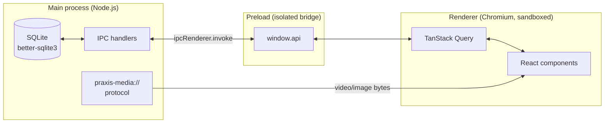
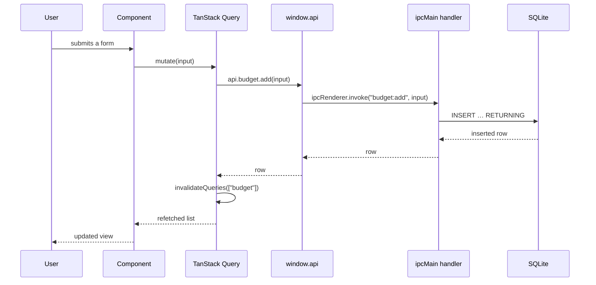

# Architecture

PraxisOS is a local-first desktop application. Everything it stores lives in a
single SQLite file inside the operating system's per-user application data
folder. There is no server, no account, and no network call in the normal
running of the app.

## Process model

Electron splits the app across three JavaScript contexts. The split is not
cosmetic — it is the security boundary that lets the UI stay sandboxed while
still reaching the database and the filesystem.

**Main** owns all state. It opens the database, runs the schema DDL, registers
every IPC handler, and serves user-uploaded media. Nothing else may touch the
disk.

**Preload** runs with `contextIsolation` on and exposes exactly one object,
`window.api`, built from the typed contract in `src/shared/types.ts`. The
renderer therefore has no `require`, no `fs`, and no ambient Node access — it
can only call the functions the bridge chose to expose.

**Renderer** is an ordinary React application. It never reasons about SQL. It
calls a query hook, gets typed data back, and renders it.

> The preload script must be CommonJS. `package.json` deliberately does *not*
> set `"type": "module"`, and `electron.vite.config.ts` pins `.js` (CJS) output
> for main and preload. If that changes, the preload fails to load, `window.api`
> is never injected, and the entire UI silently stops responding to input.

## Layers of a feature

Every feature crosses the same four files, in the same order. Adding a panel is
mostly a matter of walking this list.

| Layer | Location | Responsibility |
| --- | --- | --- |
| Schema | `src/main/db/schema.ts` | Drizzle table definition |
| DDL | `src/main/db/client.ts` | Idempotent `CREATE TABLE` + column migrations |
| Handlers | `src/main/ipc/<feature>.ts` | `ipcMain.handle` channels; all SQL lives here |
| Contract | `src/shared/types.ts` | Row and input types shared by both sides |
| Bridge | `src/preload/index.ts` | Exposes the channels on `window.api` |
| Hooks | `src/renderer/src/queries/<feature>.ts` | TanStack Query wrappers + cache invalidation |
| UI | `src/renderer/src/components/<feature>/` | React components |

### Why no migration tool

The database is single-user and never shared between machines except through an
explicit backup file. Schema changes are applied by `client.ts` at startup:
`CREATE TABLE IF NOT EXISTS` for new tables, and a `PRAGMA table_info` check
followed by `ALTER TABLE … ADD COLUMN` for new columns. This is idempotent, runs
in milliseconds, and removes a build-time dependency that added nothing for a
local app.

## Data flow for a write

Mutations return the affected row rather than a status flag, so the cache can be
updated without a second round trip when that matters.

## Media handling

User-supplied exercise videos and pasted note images are copied into a `media`
folder next to the database, and referenced by filename only.

They are **not** served over `file://`. In development the renderer is loaded
from `http://localhost`, and Chromium refuses to load `file://` subresources
from an `http://` document — that is why an uploaded video used to render as a
black player with dead controls. `src/main/mediaProtocol.ts` registers a custom
`praxis-media://` scheme instead, declared as `standard`, `secure` and
`stream`-capable so that `<video>` can issue range requests against it. The
handler resolves the basename against the media directory and refuses anything
that tries to escape it.

## Time storage

All timestamps are stored as local wall-clock strings (`YYYY-MM-DD HH:MM:SS`),
never as UTC ISO strings. `src/shared/datetime.ts` is the only place that
formats or parses them.

The reason is that this is a journal, not a distributed system. "I started
focusing at 08:30" must keep reading as 08:30 after a timezone change or a DST
boundary — re-interpreting it as an instant on a global timeline would be
actively wrong for the user's own records.

## Search

Note search uses SQLite's FTS5 extension. A virtual table shadows `notes`, kept
in sync by three triggers (insert / update / delete), and results are ranked
with `bm25`. Prefix matching is enabled so search feels responsive as the user
types.

## Theming

Themes are CSS custom properties on `:root`, stored as bare HSL triplets
(`24 62% 52%`) and consumed as `hsl(var(--primary))`. Eight built-in themes are
plain CSS attribute selectors (`[data-theme="nord"]`).

A **user preset** is a *diff on top of a base theme*, not a replacement palette.
It always sets an accent, and may optionally override the background and the
text colour. When background is left inherited — the common case, "the Light
theme but with an amber accent" — the preset writes only the accent tokens, so
every surface, card and border still comes from the base theme's stylesheet.
Overrides are applied as inline properties on the root element and cleared in
full before each re-application, so switching between presets never leaves a
stale token behind.

## Performance

Panels are `React.lazy`-loaded, and Vite's `manualChunks` splits the three heavy
dependencies (Recharts, the markdown pipeline, framer-motion) into their own
chunks. The dashboard therefore does not pay for the charting library until a
chart is actually on screen.

## Backup format

A single versioned JSON document (`praxisos-backup`, `formatVersion: 1`) covers
all tables. The same format is used for export and restore, so any backup
remains readable by later versions. Restore replaces the entire database
contents inside one transaction and reports how many rows were written and which
referenced media files are missing from this install.
