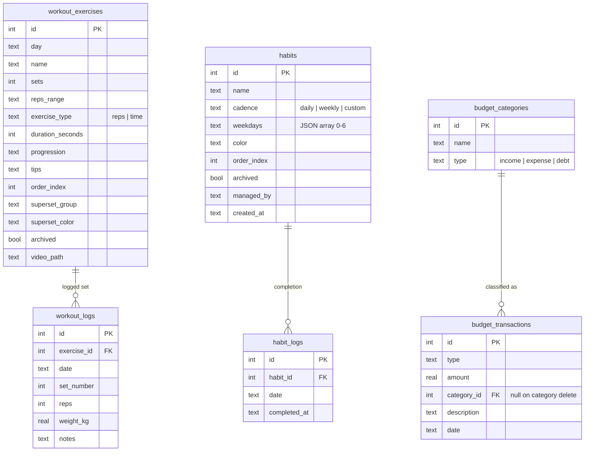

# Entity relationship diagram

The schema is deliberately shallow. Most panels own one or two tables that no
other panel reads, which is what keeps a feature change from rippling across the
app. Only three real foreign keys exist.

## Standalone tables

These have no foreign keys. Each is owned by exactly one panel.

```mermaid
erDiagram
    tasks {
        int  id PK
        text text
        text priority "Eisenhower quadrant"
        text status "todo | in_progress | completed"
        text due_date
        text started_at
        text finished_at
        text created_at
        text completed_at
    }

    focus_sessions {
        int  id PK
        text category
        text label
        text date
        text start_time
        text end_time
        int  duration_seconds
        text status "running | paused | completed"
        int  accumulated_seconds
        text last_started_at
    }

    nutrition_logs {
        int  id PK
        text date
        text meal
        text food
        real calories
        real protein_g
        real carbs_g
        text time
    }

    foods {
        int  id PK
        text name
        text category
        real calories
        real protein_g
        real carbs_g
        text serving_label
        text created_at
    }

    hydration_logs {
        int  id PK
        text date
        int  amount_ml
        text time
    }

    courses {
        int  id PK
        text title
        text provider
        text category
        int  phase
        text url
        text status
        text notes
        text created_at
    }

    journal_entries {
        int  id PK
        text date UK
        text morning_intentions
        text evening_reflection
        text updated_at
    }

    brain_dumps {
        int  id PK
        text date
        text content
        text created_at
    }

    notes {
        int  id PK
        text title
        text content
        text tags
        text created_at
        text updated_at
    }

    theme_presets {
        int  id PK
        text name
        text base_theme
        text background "null = inherit base"
        text accent
        text foreground "null = inherit base"
        text created_at
    }

    settings {
        text key PK
        text value
    }
```

## Notes on specific choices

**`settings` is a key/value table, not a wide row.** Adding a preference means
writing a new key, with no DDL and no migration. Values are stored as strings
and coerced on read against the typed `Settings` shape in `src/shared/types.ts`.

**`focus_sessions` stores both an end time and an accumulated duration.** A
session can be paused and resumed, so elapsed time is not simply
`end_time - start_time`. `accumulated_seconds` holds the time banked before the
current run, and `last_started_at` marks when the current run began. This is
also what makes editing a running session's start time work correctly: the edit
shifts `accumulated_seconds` by the difference, so the live display updates
immediately instead of continuing to count from the old value.

**`budget_transactions.category_id` is `ON DELETE SET NULL`,** not cascade.
Deleting a category must never delete the money that was spent under it — the
transaction survives as uncategorised.

**`workout_logs` and `habit_logs` cascade.** Here the log genuinely has no
meaning without its parent: a set logged against a deleted exercise, or a tick
against a deleted habit, is not recoverable information.

**`theme_presets.background` and `.foreground` are nullable by design.** Null
means "inherit from the base theme". See the theming section of
[Architecture.md](Architecture.md).

**Dates and times are separate `text` columns** (`date` as `YYYY-MM-DD`, `time`
as `HH:MM:SS`), stored in local wall-clock form. Grouping a day's rows is then a
plain string equality, and SQLite's `date()` / `time()` defaults line up with
the same representation.
