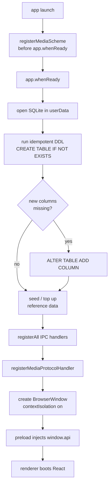
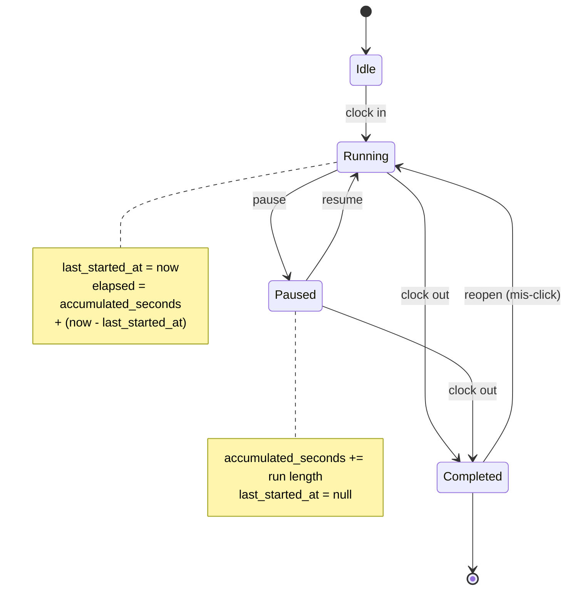
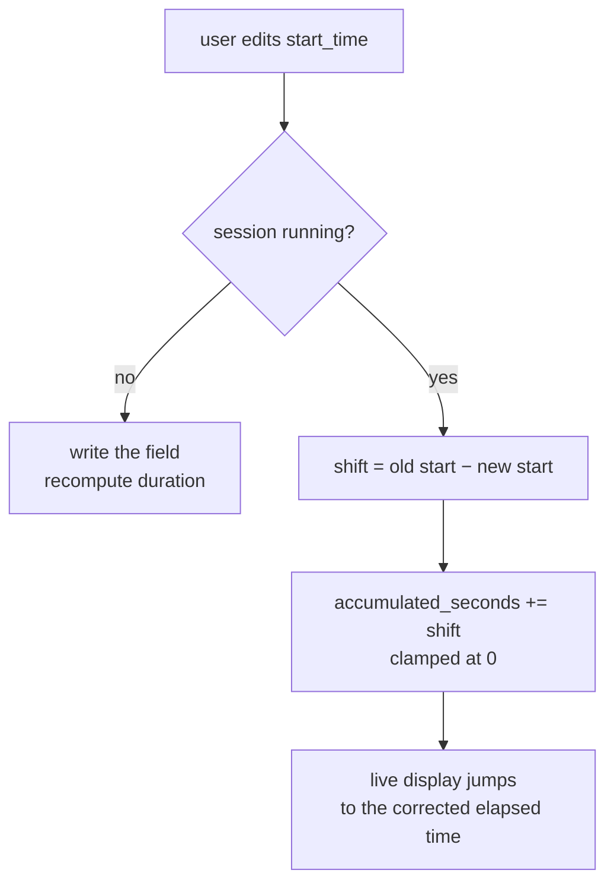
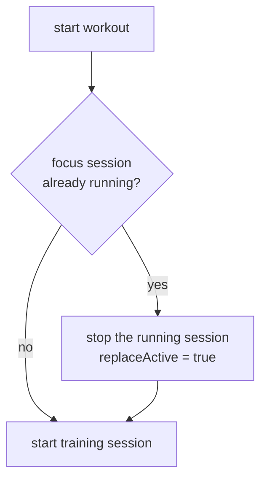
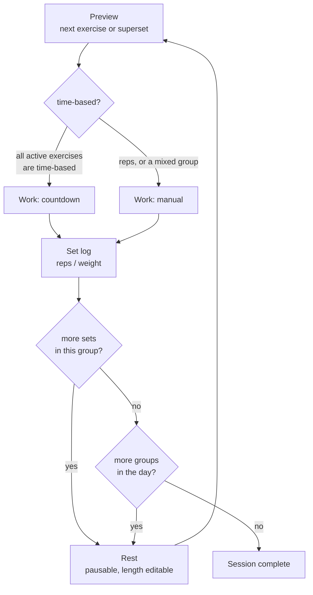
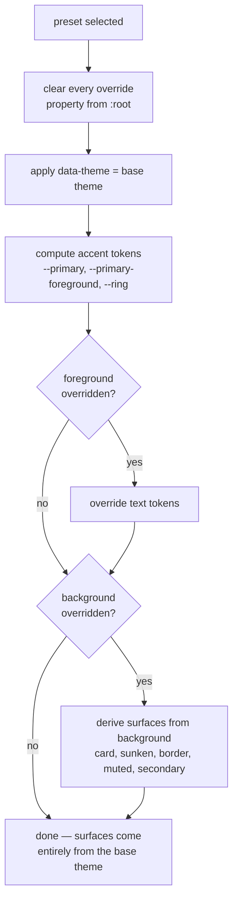
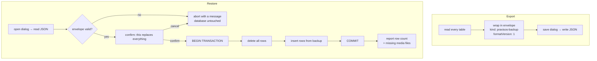
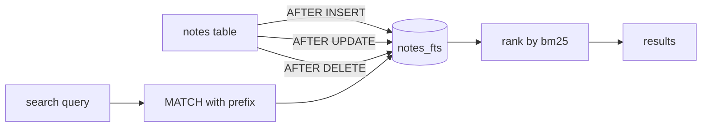

# Flowcharts

Diagrams for the flows where the behaviour is not obvious from the code. The
straightforward CRUD panels are omitted deliberately.

## Application startup

The scheme must be registered *before* `whenReady` — privileged schemes cannot
be declared once the app is running. The handler is registered after, because it
needs the app to be ready to resolve paths.

Seeding is a *top up*, not a one-shot. An early version only seeded when the
table was empty, which meant existing installs never received categories added
in later versions. Reference data is now reconciled on every start: missing rows
are inserted, existing rows are left alone.

---

## Focus session lifecycle

### Editing the start time of a running session

Without the shift, the stored start time changes but the ticking display keeps
counting from `last_started_at`, so correcting a session started at 08:30 but
clocked in at 09:30 would still read 30 seconds.

### Starting a workout while focusing

---

## Workout session engine

Two rules that are easy to get wrong:

- **Mixed supersets.** A group only auto-runs a countdown if *every* exercise
  still active in the current set is time-based. One rep-based exercise in the
  group forces manual confirmation for the whole group, otherwise the set log is
  skipped and the reps go unrecorded.
- **Uneven set counts.** An exercise whose `sets` is lower than the current set
  number drops out of the group and is shown as finished, rather than silently
  disappearing or being asked for again.

---

## Theme preset resolution

The unconditional clear in the first step matters: a preset that inherits its
background emits no surface properties at all, so without it the previously
applied preset's background would survive on the root element and bleed into the
new one.

---

## Backup and restore

Restore is all-or-nothing. A malformed or partial file leaves the existing
database exactly as it was.

---

## Note search indexing

The triggers keep the virtual table in sync, so no application code has to
remember to reindex after a write.
