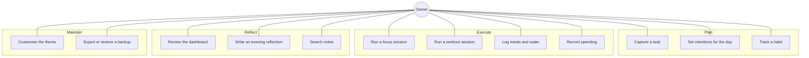

# Use cases

There is exactly one actor: the person the app belongs to. PraxisOS has no
accounts, no sharing, and no second role. Everything below is written from that
single perspective.

---

## UC-1 — Capture a task

**Goal** Get something out of your head and into the right quadrant.

1. Open **Todo**.
2. Add the task, choosing an Eisenhower quadrant (urgent/important).
3. Optionally set a due date.
4. Drag the card between *To do*, *In progress* and *Done*.

**Rules**
- Moving a card to *In progress* stamps `started_at`; moving it back to *To do*
  clears it.
- Moving to *Done* stamps `finished_at` and `completed_at`.
- Both stamps are visible on the card, so elapsed working time is recoverable.

---

## UC-2 — Set intentions for the day

**Goal** Decide what the day is for before it starts.

1. Open **Journal**.
2. Write the morning intentions for today's entry.
3. Anything unstructured goes into the brain dump list instead.

**Rules**
- One journal entry per date, enforced by a unique index. Re-opening the panel
  edits the existing entry rather than creating a second one.
- Edits autosave; there is no save button to forget.

---

## UC-3 — Track a habit

**Goal** Keep a streak honest.

1. Open **Habits**.
2. Create a habit with a cadence: daily, weekly (one weekday), or custom
   (several weekdays).
3. Tick the habit on the matrix for each day it is done.

**Rules**
- A habit is only "due" on days its cadence covers; off-days do not break a
  streak.
- If habit reminders are enabled in Settings, a native notification fires at the
  configured time listing habits still open today.
- The workout schedule in Settings can auto-manage a habit; those are marked
  with `managed_by` and follow the schedule rather than manual edits.

---

## UC-4 — Run a focus session

**Goal** Measure where the day's attention actually went.

1. Open **Focus Timer**.
2. Pick a category (Deep Work, Learning, Entertainment, …) and optionally a
   label.
3. Clock in. Pause and resume freely. Clock out when finished.

**Rules**
- Only one session runs at a time.
- A running session's start time can be corrected after the fact; the live
  display shifts to match immediately.
- A session clocked out by mistake can be reopened and continued rather than
  restarted, so the record stays a single session.
- Starting a workout while a focus session is running closes the focus session
  cleanly first, instead of leaving two live timers.
- Today's time is shown as a proportional breakdown of the categories actually
  used, not one card per category.

---

## UC-5 — Run a workout session

**Goal** Get through the session without touching the keyboard more than
necessary.

1. Open **Workout** and pick the day.
2. Reorder exercises or merge them into supersets — in the main panel, before
   starting.
3. Start the session and work through preview → work → rest for each set.
4. Log reps and weight inline as each set finishes.

**Rules**
- Structural editing (reorder, superset merge/split) is disabled during a live
  session; the sequence is fixed once started.
- Rep-based exercises pause for a set-log confirmation. Time-based exercises run
  a countdown.
- In a superset, the countdown only runs automatically when *every* still-active
  exercise in the group is time-based; a mixed group falls back to manual
  confirmation.
- When exercises in a superset have different set counts, the ones that have
  finished are marked as such and drop out of the remaining rounds.
- Rest length is editable from the preview screen, not only once rest has begun.

---

## UC-6 — Log meals and water

**Goal** Keep an honest running total without data entry becoming a chore.

1. Open **Nutrition**.
2. Search the food library and add an entry, or type a one-off.
3. Add water in preset increments.

**Rules**
- Calories, protein and carbs are tracked for both logged entries and library
  foods.
- Daily goals come from Settings and drive the progress rings.

---

## UC-7 — Record spending

**Goal** Know what today cost.

1. Open **Budget**.
2. Add a transaction: type, amount, category, description.
3. Edit or delete any transaction afterwards from the list.

**Rules**
- Amounts are shown with the currency symbol after the number, separated by a
  space (`120.00 DZD`), configurable in Settings.
- Inputs clear after a successful add, so the next entry starts clean.
- "Other …" entries sort to the bottom of every category list.
- Deleting a category leaves its transactions in place, uncategorised.

---

## UC-8 — Review the dashboard

**Goal** See the state of everything in one screen.

1. Open **Dashboard**.

**Rules**
- The counter row (focus time today, open tasks, in progress, done today, notes)
  is clickable; each counter deep-links to the panel it summarises.
- The weekly focus chart always renders a full seven-day axis, so bar width
  stays constant whether one day or seven have logged time.

---

## UC-9 — Write an evening reflection

**Goal** Close the loop on the day.

1. Open **Journal**.
2. Fill in the evening reflection on today's entry.

---

## UC-10 — Search notes

**Goal** Find something written weeks ago.

1. Open **Knowledge Base**.
2. Type into the search field.

**Rules**
- Search is full-text (FTS5) over title and content, with prefix matching, and
  results are relevance-ranked.
- Notes support rich formatting — bold, italic, headings, lists, quotes, links,
  text colour and highlight — and pasted images, which are stored locally and
  rendered inline.

---

## UC-11 — Customise the theme

**Goal** Make the app look the way you want without breaking its contrast.

1. Open **Settings**.
2. Pick one of the eight built-in themes, or create a preset.
3. A preset takes a base theme, an accent, and optionally a background and text
   colour.
4. Pick a font; it applies across the whole app, including headings and numerals.

**Rules**
- Leaving background and text inherited changes *only* the accent — the base
  theme's surfaces are untouched.
- Changes anywhere in Settings raise a single save control in the bottom-right
  corner, with a revert option. Nothing is written until it is saved.

---

## UC-12 — Export or restore a backup

**Goal** Not lose everything.

1. Open **Settings → Backup & restore**.
2. Export writes one JSON file covering every table.
3. Restore reads that same format back.

**Rules**
- Restore is destructive: it replaces all current data, and asks for explicit
  confirmation first.
- The whole restore runs in one transaction — it either fully succeeds or leaves
  the database untouched.
- Afterwards the app reports the row count written and names any media files the
  backup references that are not present in this install.
